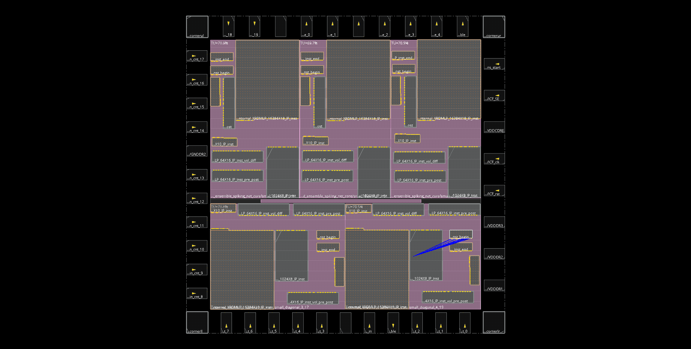

# Digital learning log


## 02 July 2024

Today I reviewed the low power synthesis lab, which basically inserted clock gating into the flops to reduce power consumption.

And there is one key file to be inserted before synthesis, that is TCF (toggle count format).

this can be generated by running simulation using specific settings.


As suggested by the name, TCF records the signal toggling information where possibility of toggling and actual toggle counts for a siganl are recorded.

This flow can be illustrated as follows:


The command to generate this file is:

```tcl
dumptcf [-dumpwireasnet] [-flatformat] [-inctoggle] [-internal] [-output filename] [-overwrite] [-scope scope_identifier] [-verbose]
```

The detailed options explanations:

+ *-dumpwireasnet* requests to only dump ports in the pins section of the TCF file.
+ *-flatformat* requests to generate the TCF file in flat format. By default, the TCF file is generated in hierarchical format.

+ *-inctoggle* requests to dump TCF data for x and z transitions. By default, only transitions from 0 to1, and from 1 to 0 are included.
+ *-internal* requests to include internal nets and signals in the probe.
+ *-output* allows you to specify the name of the TCF file. The default file name is ncsim.tcf. This file is written to the directory from which the simulator was invoked.
+ *-overwrite* allows overwriting of an existing TCF file.
+ *-scope* specifies the scope of the hierarchy for which the TCF needs to be dumped. By default, the top-level scope or the current debug scope is the scope for dumping TCF.
+ *-verbose* displays informational messages during the generation of the TCF file.

example as here:

```tcl
ncsim> dumptcf -scope testbench.top -output tcf.dump -flatformat -dumpwireasnet

ncsim> run 3000 ns

ncsim> dumptcf -end

ncsim> run

ncsim> exit
```


### DFT synthesis

So apparently, if we are having untestable logic like ROM/RAM, shadow logic needs to be added around these blocks to finish the scan insertion.

First, do the generic synthesis.

Then add the shadow logic with the following command:

```tcl
add_shadow_logic -auto -test_control <Test_pin_name>
```

### Create SDC file


#### Define all the clocks


The command should be:

```tcl 
create_clock -name <clock_name> -period <period_number> -waveform  {rising_edge_time  falling_edge_time} [get_ports <clock_port_name>]
``` 


Then there should be clock latency set. There is no hard rule about how much should be set, but it needs to be realistic.

```tcl 
set_clock_latency 5 [get_clocks <clock_name>]
``` 


Now you should set up the setup and hold time.

The setup time should be 10% of clock period or larger, but max at 5 ns should suffice for low speed designs.

```tcl 
set_clock_uncertainty -setup 5 [get_clocks <clock_name>]
```


The hold time should be about the delay of an **INHDX1** in typical operating condition (1.8V/25C)

```tcl 
set_clock_uncertainty -hold 0.3 [get_clocks <clock_name>]
``` 


#### Timing of IOs

Now we need to add input and output delay

The document has suggested half way between the active clock edges is usually "the safe way"

Therefore for a clock period of 50, and a duty cycle of 50%, we would define 12.5 as the input/output delay.


```tcl 
set_input_delay -clock [get_clocks <clock_name>] -add_delay 12.5 [remove_from_collection [all_inputs] [get_ports CLK]]
set_output_delay 12.5 -clock CLK [all_outputs]
```


Setting the environment of the IO signals

Here the example assumed a weak driver from outside and a reasonable load. 

Where 0.4 pf is approx 2 mm of wiring in 180 nm.

```tcl
set_driving_cell -lib_cell INHDX1 [all_inputs]
set_load 0.4 [all_outputs]
``` 


Here the example prohibits the synthesis of buffer trees for some signals

```tcl 
set_ideal_network -no_propagate [get_nets RESET]
set_ideal_network -no_propagate [get_nets TEST_ENABLE]
```


#### Special consideration

If there is non volatile memories or any special analogue signals in the design, they should be left alone:


```tcl 
set_dont_touch_network [get_nets CP_OUT]
``` 


#### Power planning for XH018

General strategy for power planning is to leave all power routing in top 2 metal layers.


Top metal might be called MetMid or METTP.


Rings and stripes in general should have 10 um width, distance between stripes should be 250-350 um to ensure no more than 100 mV IR drop between rings and stripes.


Not sure what the following statement means, but it was included in the design guidelines:

Depending on placement of the supply pins from outside it is often a good idea to have the stripes closest to the supply pin locations 20 um wide for better power distribution.

Are the supply pins VDD/GND?


#### Other miscellaneous rules


I/O on the left/right of a block should use MET 1/3/5


I/O on the top/bottom side of a block should use MET 2/4/6


Avoid using top two metal layers for I/O pin planning


Spacing of I/O should be minimum 0.56 um for MET1 -> MET5, 1.12 um for METTP/MetMid


For clock signals (and signals belonging to a clock tree) an “extra spacing” (one empty routing track left and right of the clock signal) is a good idea to minimize crosstalk. Width and spacing of those signals are “standard” from the PDK.


## 03 July 2024


Was trying to look for the PC requirements for Genus synthesis solutions to check if the bottleneck is the RAM. But this is nowhere to be found and they have all been talking about CPUs.


Now checking the cadence product manual to see if I can get any answer.


Tried to go through the flow for my old bin ratio ensemble design again, but it seems a lot of connections has been disconnected or deleted.

Think it might be due to the fact that there is no memory IP, so that they have all been deleted.


## 17 July 2024


After another experiment with the single encoder, I believe it is not possible to compress everything in 10 um, it needs at least 2 rows with extended top and bottom space for pins placement and power stripes.


Now experiment again with double decker.

I managed to implement the double decker within 20 um????

The final layout looks like this:


The dimension of the design is width: 112, height: 17.92


This design also passed the DRC check/connectivity check and timing check.


Have just extracted the RC, and exported the sdf file, will try to do a post-layout simulation.


By comparing the standard cell verilog library against mine generated from Conformal, I found that mine does not contain *Specify* block, which is seen by the example from the RAK.

But they are existent in the OA library for each cell in their functional folder, so I am considering copying the needed ones over for now as a temporary solution.


Eventually, I will need a verilog library for all the standard cells, this should be doable using a bash script.

But there are units that are not logged in the catalogue, which has been reported unresolved during simulation.

So what is "u_mx2", "u1_fd5" and "checkrs" that appeared in the logic definition of SDFRRQHDX1?

They are nowhere to be found, I should check XFAB portal later on when I have the access to see where to find the verilog for the library.


## 18 July 2024

Think I just found the VLG primitives directory for "u_mx2", "u1_fd5" and "checkrs".

They are listed in the folder 

"/eda/design_kits/xkit_root/x_all/diglibs/VLG_PRIMITIVES/v1_2/cadence_IC61/v1_2_0/VLG_PRIMITIVES"


After generating another big library verilog file, I am now able to do post-layout simulation with timing information annotated.

And I also noticed that the synthesis or PnR reorganised the scan chain for the design.


## 22 July 2024

Managed to log into XFAB portal to access the IP.

Simply click on Design-Compilers & Webtools to access memory IPs.


Then click on the "play" button, it should direct you to the frontend compiler page, where you should see the configuration page for this IP.


Then you will be able to download the needed files attached to this IP for implementation.


### XROMLP_128X8_M16P_INDEX_MEM

This is the ROM IP generated from the compiler.

I should now do some simulation to check up the timing information for this IP.

This memory block has the following ports:

+ CLK 
+ CEn, active low enable signal
+ A, 7 bit address
+ Q, 8 bit data output
+ RDY, data ready signal 

It needs to be mentioned that the active low enable signal should be asserted together with address information.

Also because the minimum WORD count for the ROM should be 128, so the address has been set as 7 bit, but originally in my design, I only need 41 entries. So I could not ask for a 64-entry ROM.

Will try to load up the ROM with programe file and then check up the ports behaviours.

According to the included timing information, the min cycle time (clock period) at slow condition (125 C 1.62V) is **6.33 ns**, this means the ROM cannot operate at more than **158 MHz**.


It can be seen that the address was read on 530,000 ps, and the data was updated at 536,110 ps.

This has a delay of about 6,110 ps or 6.11 ns, which has been listed in the timing table at the worst case scenario with the PVT condition of 1.62V, 175 C.


## 23 July 2024

Trying to simulate my old project with the memory files included, but apprently, you cannot include memory files like additional library files.

So absolute path needs to be provided instead of a single file name.

I have already generated ROM IP for index memory and csc weight memory, now I should check RAM IP for my voltage memory, which should be a single clock RAM.

Ok I will now generate all the necessary IPs I needed for my old project

Apparently there are following memories that need IPs support:

ROM:

+ offset_mem, 128X10 XROMLP
+ weight_mem, 16384X18 XROMLP
+ CSC_weight_mem, 256X13 XROMLP
+ index_mem, 128X8 XROMLP


RAM:

+ double_input_voltage_mem, 2* 64X16 XSPRAMLP <==> 64X32 SPRAM 
+ voltage_mem, 64X16 XSPRAMLP
+ input_value_mem, 1024X8 XDPRRAMLP


But actually my input_value_memory does not require read and write at the same time, it should be able to be built upon a single port RAM instead.

I will now generate another XSPRAMLP for input_value_mem

Think DPRAM should be built for the application of FIFO.


## 24 July 2024

I have finished encapsulation of the offset memory module with XROMLP IP.


I can probably do CSR weight memory next.


Now that the CSR weight memory has also been modified, I will move on to CSC weight memory module.

Test and simulation should be done later.

CSC weight memory also modified!


Now I will move on to index memory.

As for this one, I need two IP blocks because I need the data on the appointed address and the next one.

Index memory modificatino finished!


Now I shall move on to the RAM encapsulation.

Coming up first should be double input voltage memory module.


Input value memory has now also been updated successfully.


I can now probably do a simple simulation with the IP encasulated design.


The simulation did not work, I will have to debug the design.

first of all, it seems the RAM has never been properly written, so I will need to do some test on the RAM.

And as for ROM, the data was never properly read because of the time it needs to process the request.


Changed the clock frequency to 50 MHz, and it turns out that the read timing for ROM is:

1 clock posedge --> address
2 clock posedge --> data out (address cannot be changed during this period)

So if I am considering making the behaviour correct, I will have to change everything.

I should just go ahead to the next step with synthesis and place and route.


## 25 July 2024

I shall go ahead with the whole digital implemntation flow with what I already have to make a proper **CHIP**

First I shall make a wrapper on top of the whole design, but this should probably be waited after synthesis and scan path inserted.


### Synthesis

#### Memory initialisation complaint

At first, it was complaining about the memory initialisation where only 2 dimensional memory array is allowed to be initilaised with readmem keyword.

So I removed the initialisation block by defining the block to be only available when macro **SIM** is defined.


#### Illegal positional port association CDFG-817

And then I was reported with illegal positional port association with power and ground pins during elaboration.

```text
Error   : Illegal positional port association for instantiation of cell with power and ground pins. [CDFG-817] [elaborate]
        : Instantiation of cell 'XROMLP_128X10_M16P_OFFSET_MEM' has positional instantiation..
        : Only named port association is allowed for instantiations of cells with power and ground pins.

```

At first I thought this is because the problematic definition of the verilog files from IPs.

So I removed them from the RTL folder, which did not help.


I am then assuming this is becasuse the instantiation did not have the original port delcared while connecting the module to wires. 

So I only changed offset memory to see if I am right about this.

The experiment shows that the error messages previously reported about offset memory has been eliminated.

And it has reported a new error about XSPRAMLP now.

All I have to do is to change the instantiation from:


```verilog
// IP instantiation

XROMLP_256X13_M16P_CSC_WEIGHT Internal_XROMLP_256X13_IP_inst (internal_data_out, addr, clk, 1'b0, ready_signal);
```

to the following with clear port declaration:


```verilog
// IP instantiation

XROMLP_256X13_M16P_CSC_WEIGHT Internal_XROMLP_256X13_IP_inst (.Q(internal_data_out), .A(addr), .CLK(clk), .CEn(1'b0), .RDY(ready_signal));

```

#### Important warnings about ports connection CDFG-467 CDFG-466

Elabortion passed!!!!!


But it is reporting some other undriven ports issues, I will have a close look.

First reported undriven issue is about the input value memory

```text
Warning : Libpin is wider than connected signal. [CDFG-467]
        : Signal width (1) does not match width of input port 'A' (10) of instance 'Internal_XSPRAMLP_1024X8_IP_inst' of libcell 'XSPRAMLP_1024X8_M8P_INPUT_VALUE' in file '/home/j05003sx/Old_proj/bin_ratio_ensemble_SNN_hardware/Syn/../RTL/input_value_mem_1024X8_XSPRAMLP.v' on line 15.
        : This may cause simulation mismatches between the original and synthesized designs.
```

And then I realised that my definition of wire **addr_to_RAM** is a single wire as in "wire addr_to_RAM" instead of "wire \[9:0\] addr_to_RAM".


Then similar warnings were reported about index memory.

And then it is reporting that one port is wider than expected.

that is for the input address of end RAM.

```text
Warning : Connected signal is wider than libpin. [CDFG-466]
        : Signal width (32) does not match width of input port 'A' (7) of instance 'Internal_XROMLP_128X8_IP_inst_end' of libcell 'XROMLP_128X8_M16P_INDEX_MEM' in file '/home/j05003sx/Old_proj/bin_ratio_ensemble_SNN_hardware/Syn/../RTL/index_mem_128X8_XROMLP.v' on line 19.
```

and apparently, this is due to the fact that the connection was defined as:

```verilog
XROMLP_128X8_M16P_INDEX_MEM Internal_XROMLP_128X8_IP_inst_end (.Q(end_index), .A(neuron_index+1), .CLK(clk), .CEn(1'b0), .RDY(ready_signal_2));
```

The port definition **neuron_index+1** will automatically expand the width for a 6 bits adress to 32 bits.

This has been fixed!!!

Ralised that I forgot to insert scan path.....

I will leave that to next time.


### Place and Route

Now starting the PnR process, I have written an io pads verilog file to wrap the core design inside to make a chip.

After sorting out all the errors in my verilog files and LEF files, the whole chip design is displayed with design guide and IP blocks.


Just realised that I am using pad limited IO pads instead of core limited IO pads for this layout....

I prbably need to make another IO pads definition....

I will save the design for now and come back tomorrow for the fix of floor plan and IO pads...


## 26 July 2024

Since I realised that I have used the wrong pin pads for the design... I should probably also redo synthesis, because the driving cells have changed and this needs to be reflected on the constraint file.

I can also plug in reset synchronisation and scan path this time.

IO_CELLS_3V: pad-limited design

IO_CELLS_F3V: core-limited design 

So I should use library **IO_CELLS_F3V** and as for cells, the input cells should be ICF and output cells should be BT1F


Also the corner cells could be CORNERF, CORNERSF or CORNERLF CORNERESDF.

+ CORNERF: Corner cell with standard cell height, valid for a very small chip with EXTENT area size < 1mm^2.
+ CORNERSF: Corner cell, valid for a small chip with 1mm^2 <= EXTENT area size < 100mm^2.
+ CORNERLF: Corner cell, valid for a large chip with EXTENT area size >= 100mm^2.
+ CORNERESDF: Corner cell with ESD protection structure with standard cell height, valid for a very small chip with EXTENT area size < 1mm^2.

Guess I can check roughly the size of the chip layout from yesterday and descide which cell I should use.

After checking the layout I imported yesterday, the overall core gives 2.072 X 2.059 = 4.266 mm^2, which suggests I should use **CORNERSF**.


As for power cells, I used to use 

VDDORPADP, GNDORPADP and VDDPADP respectively for 3.3 V, ground and core VDD (1.8V).

Now they should be replaced with:

VDDORPADF, GNDORPADF and VDDPADF.


### Synthesis

Make a new folder as Syn_DFT and redo all the steps needed.

The tool is reporting that the newly added port SE does not have external driver/transitions, I guess I dot not have to do anything about it.


### Equivalence check

I noticed that some inputs are removed during synthesis, and I wonder if this would cause inconsistency.

I shall now run a consistency check using LEC.

So you can add the liberty file into the library separately using -append option.

The tool apparently is complaining there is nonequivalence between our golden design and synthesized design.


## 29 July 2024

I will ignore the inconsistency during the consistency check for now and move on to the place and route.

A systematic tutorial on LEC will be arranged for future use.


### Place and Route

Modified IO pads module to add extra 3 pads for scan path, shift enable and such.

Also added reset synchronisation in the top Chip wrapper.


## 30 July 2024

Now I am just organising the floor plan before power routing and placement.

After some rearranging I gave up the idea of ungroup the design too much, simply into 5 cores and 1 top state machine should be enough.

And the layout of my chip looks like this:




Checked the floorplan and fixed the corner cell error, this is then followed by tons of warnings about IP block not being encampassed with halo.

This will be added now.


I have added stripes and power ring, now it has come to power rails, it is taking a while to generate.

I am also wondering how these IP blocks should be connected to power and ground.

Okay, there are a million dangling wires erros in the layout 💀.


This is not looking good at all....


Think I will stop moving forward for this design.


And also I think surround the IP with a ring would be a better idea so that the IP can be powered up.

I need to check the manual again to see how to hook up the IP into power.

I will call it a day today.


## 31 July 2024

I realised I can probably make some partition before the whole implementation???

I will try that now.

I would still have millions of dangling wires even If I have added block rings.

But I also noticed that the manual calls for a halo block around the IP.

This has not left much room for placment and route.


I will have to think closely how to integrate IPs into designs.

Probably, I can start by having a small design with only 1 IP.


Additionally, I need to check the placement of the example I had from the tutorial.

It seems that each IP needs a halo and their own power ring.


## 1 Aug 2024

After observing the example from the tutorial, it can be seen that innovus did not complain about the dangling wire here.

and Halo has to extend out of the power ring encompassion.

So apparenlty, it has the same connectivity errors as me, it also has dangling wires, I am going to check if this will be fixed in the future.


After cheking online, it looks like the dangling wires situation around macros are minimal issues and should not be a big problem during P&R.


this can later be resolved during detailed routing.


The blue part is the pre_processing module, integrate no fire module is at the top left corner and spike generation module is at the bottom.

And it turns out that the bottom aread was basically not used, this makes me think that placement of macros should be around edges

As for a partition, there is no def file for the scan chain, one has to manually define the scan chain using the following command:

```tcl 
create_scan_chain -name {<scan_chain_name>} -start {<starting_point>} -stop {<stopping_point>}
```
And of course, we have a loooooot of DRC violations after routing.


## 5 Aug 2024

### New project: FIFO construction

The dual port RAM I have acquired is a dual port RAM, XH018 LPMOS XDPRAM_1024X8_M8P_INPUT_VALUE.

This RAM has 1024 entries and is 8 bit wide.

IP information:

+ cell name: XDPRAM_1024X8_M8P_INPUT_VALUE
+ number of words: 1024
+ number of data bits: 8
+ number of address bits: 10

It has to be noted that there are 2 read/write signals (WEnA, WEnB) for both side A and B and 2 enable signals (CEnA, CEnB) for both A and B. Besides, it has another signal: OEnA/B, which is the output enable.

Where write enable signal works by enable the write process when it is low, otherwise it is for read.

I thought I could probably use single port ram for FIFO, but realised that I need write and read processes available simultaneously. This cannot be done with a single port RAM.

There is a line of comment that says: **Keeping CEnA, CEnB high when memory is not active prevents unnecessary power consumption.**


And in different PVT corners, the operating performance is different.

At the fastest corner (1.98V, -40C), the min cycle time is 3.76 ns.

While at the slowest corner (1.62V, 175C), the min cycle time is 12.02 ns


#### ❗**Simultaneous read/write case**

Reading from the same address on both ports is allowed, there will be no issue.


Reading from one port that is being written at the same address will result in undefined read data, but the writting process will be completed successfully.


Avoid writting to the same address at the same time, because this will result in unpredictable data.


There is a minimum time interval between writing to one port and any other operation at the same address, called clock collision time. This value is at least 5.27 ns under PVT of 175C and 1.62V.


## 6 Aug 2024

I can probably have a rough specification set up today for this FIFO that is built around th IP block.


After a little research, I realised that FIFOs are categorised into synchronous and asynchronous types.

Where synchronous FIFO uses same clock for both read and write process, while asynchronous FIFO uses different clocks for read and write.

asynchronous FIFO design involves pointer gray code conversion, synchronisation by the other clock and revserse gray code conversion.

I can implement two different versions of FIFOs and test them both given that we do not know what typs of FIFO we are using now.


## 7 Aug 2024

Based on the findings made yesterday, I will develop 2 separate FIFO design with both synchronous and asynchronous features.

Will start the synchronous design first and save the unfinished design created yesterday as asynchronous design.


### Synchronous FIFO design

The synchronous FIFO design should have the same clock for both read and write, this means that the reading and writing should be operated at the same rate. The key signal that is controlling the gap should be the write and read enable signals. They should be active low signals.


The design is finished, now I am trying to operate a simulation with the worst delay time option turned off.

The preliminary simulation showed correct behaviours of writing information, I have not tested read information yet.

But it seems the indicator flag "almost_full" is not correct.


I have changed the condition to calculate "almost full" and "almost empty", take "almost full" as an example.

The write pointer has to be smaller than the read pointer and the gap between them has to be equal or smaller than 5.

Similarly as for "almost empty", the write pointer has to be bigger than read pointer, and the gap between them has to be equal or smaller than 5.

The behaviours for flag "almost empty" and "almost full" have been fixed now.


But it has to be noted that the simulation complained about the hold violation for address, which switches at every clock edge.

This is because I am simulating a real IP with verilog model only.

I will now try to turn the option "worst timing" on.

Actually, the simulation shows the correct results, and I am assuming these can be fixed with the insertion of real gates.

But it looks like we should have at least 20 ns clock cycle.


The writing test so far has been ok.

Will now carry on to the reading test.

Somehow the reading takes longer than I thought it would be.

There should be at least 1 clock cycle delay expected from the enable signal asserted and the actual data released.

The whole reading process goes like:

1 clock: assert read_enable and address read.
2 clock: release data after access time from posedge.

I have just added a wee counter to wait until the data is stable before sampling the data from the output of the RAM.

Apparently, to secure the data, we should wait 2 clock cycles.

Now I am simulating with the worst timing behaviours.

Yes, the behaviour has been fixed, and there is no problem even with the worst timing condition.


## 8 Aug 2024

Had a chat with Steve today to talk about the new ADC that we are going to implement in the upcoming chip.
And it looks like he does not need my help with the digital implementation or the gray code counter implementation.

I have delved deep into the simulation waveform to check why there is a big delay between the address assertion and data release.

It turns out that the data was immediately released from RAM after the address was read.

But it has to pass through 2 tristate buffer before it was visible at the output port QB.

The first buffer basically takes a clocked enable signal to let through the data.

The second buffer is our output enable, which is always tied low.

Technically, there should be no delay, but the access time has been added to update the output QB only after the clock edge after the **ACCESS_TIME**.

This basically explains why the data read process is a rather slow one compared to the writing transaction.


### Asynchronous FIFO design

Now that I have implemented the synchronous FIFO design. I shall move on to the asynchronous FIFO design.


The following algorithm can be helpful

```python
    def inverse_gray32(n):
        assert(0 <= n < 2**32) 
        n = n ^ (n >> 1)
        n = n ^ (n >> 2)
        n = n ^ (n >> 4)
        n = n ^ (n >> 8)
        n = n ^ (n >> 16)
        return n
```

Inverse gray coding:

```python
def inverse_gray(n):
        x = n
        e = 1
        while x:
            x = n >> e
            e *= 2
            n = n ^ x
        return n
```


## 13 Aug 2024

I will start the implementation of the asynchronous FIFO with the IP now.

Thanks to the help from this [site](https://zipcpu.com/blog/2018/07/06/afifo.html) talking about FIFO building, I managed to understand the logic.

I have just finished constructing the asynchronous FIFO with RAM, now I am drafting the simulation testbench. 


Now I am simulating the module and debug the syntax (of course everyone does syntax check at simulation...)


Did my first write simulation and found that nothing has been written into the RAM....

But accidentally, data after address 6 has been successfully written in.


After checking the simulation log.... it looks like there is a no-operation period at the first 250 ns.

```text
110.00 ns: ERROR: async_sim_test_top.inst_Async_FIFO_XDPRAM_1024X8.dual_port_RAM_IP_inst : RAM (port A) enabled during initial 250ns: RAM content UNDEFINED


130.00 ns: ERROR: async_sim_test_top.inst_Async_FIFO_XDPRAM_1024X8.dual_port_RAM_IP_inst : RAM (port A) enabled during initial 250ns: RAM content UNDEFINED
```

Now I have extended the initialisation time, re-run simulation and start writing process after at least 300 ns.

Yes, this has been fixed now, and it looks like the burst writing is also successful.

Only thing that needs attention is that if write enable is longer than 1 clock cycle, the address will increment more than once.

This means that if the data stays at this period, duplicate data will be written into the RAM for the next address.

Now it is time to read from the FIFO...


Maybe I am missing something, but the reading cycle always needs 2 clock cycles to finish.


## 14 Aug 2024

To get to the bottom of this, it might be easier to simply just simulate the IP itself.

Even though most of the behaviour has been correct, but I cannot replicate the old data read before it switches to 

Also, I noticed that the setup timing for the address has been a strong requirements for the RAM to function properly.

During the period the side of logic is enabled, the address has to be stable for at least 5.7 ns prior to the posedge of the clock.

I will head to the next step now to synthesis the design and see what trouble I will bump into.

So far at the functional level, I believe the module is correct, But I should probably export a flag signal too, so that the following logic knows when to sample the data.

Now a ready signal has also been added to the output of the FIFO, so that the following logic can sample at the correct timing.

It will be asserted when the data is updated, and deasserted when new round of reading is started (aka. when read_enable is asserted).


## 16 Aug 2024

Today I shall have a clear look at the high seed interface design, to see what options we have and what should we take into consideration.


### FMC (FPGA mezzanine CARD)

After a bit of research, I found that FMC (FPGA mezzanine card) is a good port to input LVDS signals into FPGA.

They mainly have 2 types:

+ LPC
+ HPC

Which stands for low pin count and high pin count.

LPC supports 68 user-defined single-ended signals OR 34 user-defined differential pairs.

HPC provides 160 user-defined single-ended signals OR 80 user-defined differential pairs, ADDITIONALLY, it provides 10 serial transceiver pairs, and additional clocks.


Both connectors use the same mechanical connectors, the difference lies in which signals are actually populated.

However, the connector itself is basically impossible to solder ourselves...

We may need to seek solutions for a general purpose connector card if we are going to use this connector.

Just as I was thinking how this can be utilised, I bumped into this [board](https://www.iamelectronic.com/shop/produkt/fpga-mezzanine-card-fmc-lpc-breakout-board/) which may allow us to use the interface at a more general purpose.


But this might be a dead end search for the pin out solution.

In the meantime, I will check out for other ways to connect chip to the FPGA.


## 20 Aug 2024

Found this documents from XFAB talking about IP integration or IP black box design, which is something I should check on.


Think this tutorial basically describes how the IP can be imported into the virtuoso environment, and mainly more used for analogue design or layout design.

This can be useful in the later stage.

As a matter of fact, differential signals are still widely used in digital design, for example:

+ HDMI
+ PCI express
+ Ethernet
+ USB 2.0/3.0
+ DisplayPort
+ LVDS


Even though LVDS has been mentioned, I did not see many right out of the source application in digital design. It has normally been dumped to specialised chip to deal with the output.

So it has to be clear that LVDS does not equal to Differential.


## 21 Aug 2024

I realised that there is a test guide or module within the IP package.

Also I have just added the updated 6 metal layers technology folder for new project.

Now I guess I need to checkout the test data sheet for ROM and RAM.

And I have also just added the IP into the newly added library with no errors.

The environment is up.

Found a blogger talking about HDMI module implementation on FPGA, and the author used a module to turn single-wired signal into differential signal.

```verilog
OBUFDS OBUFDS_red  (.I(TMDS_shift_red  [0]), .O(TMDSp[2]), .OB(TMDSn[2]));
OBUFDS OBUFDS_green(.I(TMDS_shift_green[0]), .O(TMDSp[1]), .OB(TMDSn[1]));
OBUFDS OBUFDS_blue (.I(TMDS_shift_blue [0]), .O(TMDSp[0]), .OB(TMDSn[0]));
OBUFDS OBUFDS_clock(.I(pixclk), .O(TMDSp_clock), .OB(TMDSn_clock));
```

The module is called **OBUFDS**, which is a single input, double output module.

And apparently, according to Xilinx, this module is a differential output buffer primitive.

This makes me wonder if there is such thing in the digital library I am using.

Or is there such a thing in the IO?

After checking the explanation on [Xilinx.com](https://docs.amd.com/r/en-US/ug1353-versal-architecture-ai-libraries/OBUFDS), I think the buffer does not change much in terms of voltage level, but only a combination of a buffer and an inverter.


After careful reading of the document, I think this is talking about the test needed for the actual **CHIP** not the design.

I am now more concerned about this tape out.


### A look at Transition Minimised Differential Signal


This is an algorithm that proposes to encode an 8 bit number into 10 bit so that the transitions can be minimised and yet retain a balanced digit counts of 1s and 0s.

Rough steps:

+ Step 1: Apply XOR/XNOR logic
+ Step 2: Generate 9-bit intermediate code
+ Step 3: Final 10-bit code
+ Step 4: Differential pair transmission

Example: The input byte is D: 1101_0011

#### Step 1 Apply XOR/XNOR logic

condition: There are more than 4 "1" ? **OR**  There are 4 "1", and D\[0\] = 0

This is True for D, so the process requires XNOR logic.

Q<0> = D<0> = 1
Q<1> = Q<0> XNOR D<1> = 1 XNOR 1 = 1
Q<2> = Q<1> XNOR D<2> = 1 XNOR 0 = 0
Q<3> = Q<2> XNOR D<3> = 0 XNOR 0 = 1
Q<4> = Q<3> XNOR D<4> = 1 XNOR 1 = 1
Q<5> = Q<4> XNOR D<5> = 1 XNOR 0 = 0
Q<6> = Q<5> XNOR D<6> = 0 XNOR 1 = 0
Q<7> = Q<6> XNOR D<7> = 0 XNOR 1 = 0

Otherwise, "XOR" logic should be used.

#### Step 2 Generate 9-bit intermediate code


Because this is "XNOR":

Q<8> = 0

Otherwise it should be 1


#### Step 3: Final 10-bit code

condition: if display is enabled goes ahead or display content based on control word.

assume display is enabled in this case.

check the number difference between 1s and 0s in Q as diff_q_m

condition: disparity is 0? **OR** there are 4 "1" in Q<7:0>

It is a yes for us.


condition: is Q<8> 0?

It is yes for us. Therefore, our final output is as follow:

Q<9> = 1
Q<8> = 0
Q<7:0> = ~Q<7:0> = 1110_0100
disparity = disparity - diff_q_m = 0-0 = 0


Final output for D: 1101_0011 is 10_1110_0100


Detailed algorithm can be found in the picture:


A verilog implementation can be found here:

```verilog
module TMDS_encoder(
        input clk,
        input [7:0] VD,  // video data (red, green or blue)
        input [1:0] CD,  // control data
        input VDE,  // video data enable, to choose between CD (when VDE=0) and VD (when VDE=1)
        output reg [9:0] TMDS = 0
);

wire [3:0] Nb1s = VD[0] + VD[1] + VD[2] + VD[3] + VD[4] + VD[5] + VD[6] + VD[7];
wire XNOR = (Nb1s>4'd4) || (Nb1s==4'd4 && VD[0]==1'b0);
wire [8:0] q_m = {~XNOR, q_m[6:0] ^ VD[7:1] ^ {7{XNOR}}, VD[0]};

reg [3:0] balance_acc = 0;
wire [3:0] balance = q_m[0] + q_m[1] + q_m[2] + q_m[3] + q_m[4] + q_m[5] + q_m[6] + q_m[7] - 4'd4;
wire balance_sign_eq = (balance[3] == balance_acc[3]);
wire invert_q_m = (balance==0 || balance_acc==0) ? ~q_m[8] : balance_sign_eq;
wire [3:0] balance_acc_inc = balance - ({q_m[8] ^ ~balance_sign_eq} & ~(balance==0 || balance_acc==0));
wire [3:0] balance_acc_new = invert_q_m ? balance_acc-balance_acc_inc : balance_acc+balance_acc_inc;
wire [9:0] TMDS_data = {invert_q_m, q_m[8], q_m[7:0] ^ {8{invert_q_m}}};
wire [9:0] TMDS_code = CD[1] ? (CD[0] ? 10'b1010101011 : 10'b0101010100) : (CD[0] ? 10'b0010101011 : 10'b1101010100);

always @(posedge clk) TMDS <= VDE ? TMDS_data : TMDS_code;
always @(posedge clk) balance_acc <= VDE ? balance_acc_new : 4'h0;
endmodule
```

